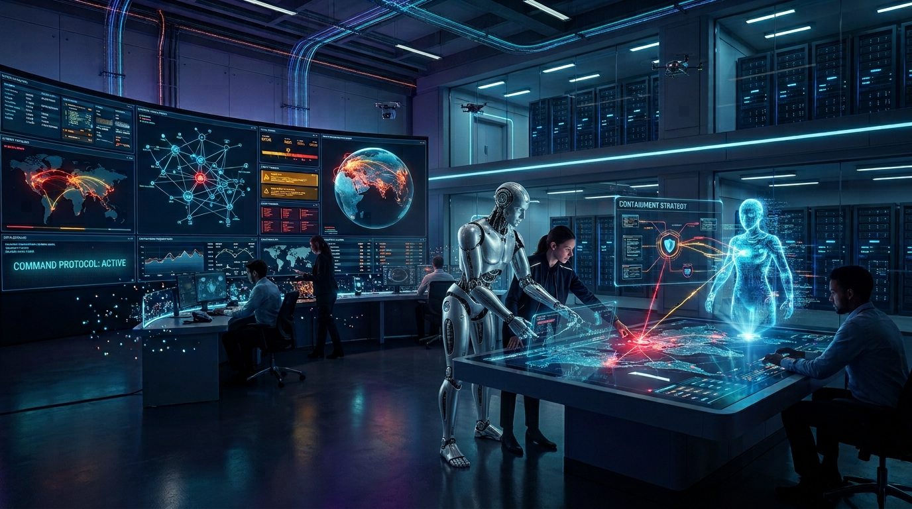
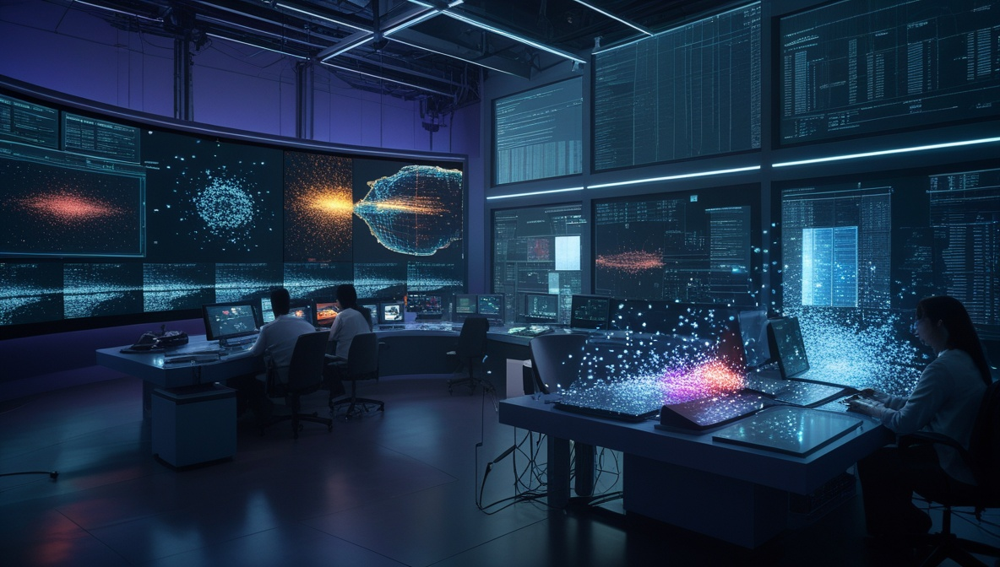
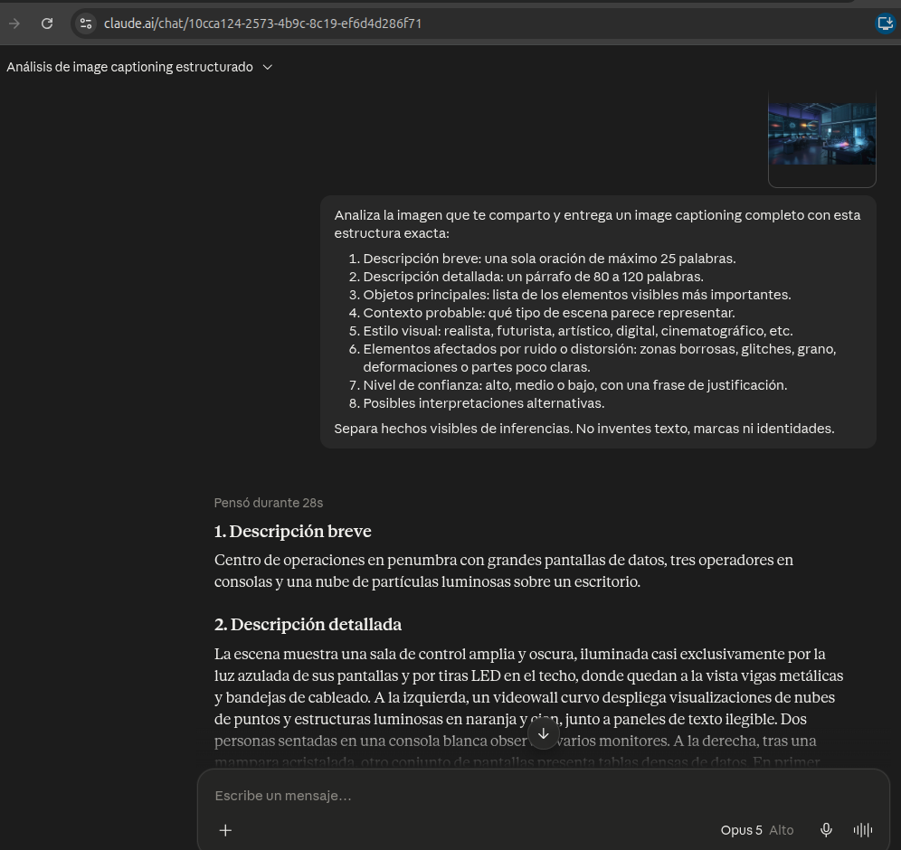

---

<div align="center">

## DIPLOMADO EN INTELIGENCIA ARTIFICIAL

---

## Módulo XII — Arquitecturas Multimodales
## PROYECTO INTEGRADOR
### Generación, transformación y descripción de imágenes con IA generativa multimodal

**Flujo multimodal:** texto → imagen → imagen transformada → descripción textual

---

**Alumno:** Genaro Isidro Alamillo Montes
**Instructor:** MSc. Jorge Alberto Pacheco Senard
**Adscripción:** Centro de Operaciones del Ciberespacio, SEDENA
**Fecha de entrega:** 11 de septiembre de 2026

</div>

<div style="page-break-after: always;"></div>

---

# 2. Tema elegido

**Tema:** *Un centro de operaciones del ciberespacio del futuro monitoreado por inteligencia artificial.*

Se trata de una adaptación de dos de los temas sugeridos en la consigna: el ejemplo 7 (*"Una fábrica automatizada con visión artificial"*) y el ejemplo 1 (*"Una ciudad futurista impulsada por inteligencia artificial"*). En lugar de una planta industrial, la escena representa una **sala de operaciones de ciberdefensa** donde analistas humanos y agentes de inteligencia artificial colaboran para detectar y contener amenazas sobre una infraestructura de red.

**Motivos de la elección:**

- Es un tema **visualmente denso** (pantallas, grafos de red, hologramas, servidores), ideal para evaluar cuánta información conserva un modelo de difusión tras inyectar ruido y cuánta recupera un modelo de *image captioning*.
- Está **alineado con mi área profesional** (evaluación de vulnerabilidades y pruebas de intrusión), lo que facilita juzgar si la descripción automática es técnicamente coherente.
- Permite cumplir con facilidad las restricciones del proyecto: **no requiere personas reales, marcas, logotipos ni banderas**.

<div style="page-break-after: always;"></div>

---

# 3. Objetivo del proyecto

**Objetivo general.** Recorrer de principio a fin el flujo de trabajo multimodal estudiado en el Módulo XII —**texto → imagen → imagen transformada por difusión → descripción textual automática**— utilizando tres herramientas de inteligencia artificial generativa distintas, y analizar de forma crítica qué información se genera, se conserva, se degrada o se pierde en cada transición entre modalidades.

**Objetivos específicos.**

1. Diseñar un *prompt* estructurado (sujeto, acción, contexto, estilo, composición, iluminación, paleta y restricciones) y generar con él una imagen original de alta calidad mediante un modelo **texto → imagen**.
2. Aplicar una **transformación basada en difusión** (*image-to-image* con control de *denoising strength*) que introduzca ruido y variación generativa **conservando el tema y la composición**.
3. Obtener una **descripción automática** de la imagen transformada con un modelo **visión–lenguaje** y evaluar su fidelidad, sus omisiones y sus errores.
4. Comparar las tres fases mediante una tabla y una reflexión, e identificar los **riesgos éticos** del flujo (procedencia, desinformación, sesgo, derechos de autor).

<div style="page-break-after: always;"></div>

---

# 4. Herramientas utilizadas

| Fase | Herramienta | Tipo de arquitectura | Rol en el proyecto |
|---|---|---|---|
| Fase 1 | **Google Gemini** — generación de imágenes | Texto → imagen (difusión latente condicionada por texto) | Generar la imagen original a partir del prompt |
| Fase 2 | **Leonardo AI — Image to Image** (modelo *Leonardo Phoenix 1.0*) | Imagen → imagen (difusión latente, *denoising* parcial) | Transformar la imagen: ruido, glitch y variación controlada |
| Fase 3 | **BLIP** vía el Space `hysts/image-captioning-with-blip` (Hugging Face Spaces) + **Claude** (modelo con visión, Anthropic) | Visión–lenguaje (encoder de imagen + decoder de texto / LLM multimodal) | Generar el *image captioning* breve y detallado |

**Cumplimiento de las reglas 1 y 2:** las tres fases usan herramientas diferentes (Gemini / Leonardo AI / BLIP + Claude); ninguna herramienta se repite entre fases.

**Justificación técnica de la selección (con base en las clases del módulo):**

- **Fase 1 — modelo texto→imagen.** Se eligió un modelo de difusión condicionado por texto porque, según se vio en el Bloque 2, la difusión ofrece "control textual muy fuerte" y mayor diversidad que las GAN clásicas, a costa de un mayor costo de inferencia que aquí es irrelevante.
- **Fase 2 — difusión *image-to-image*.** La consigna exige una herramienta "basada en difusión" con énfasis en "ruido, variación, reconstrucción o edición". *Image-to-image* con *denoising strength* es exactamente el mecanismo del *forward/reverse process* explicado en clase: se lleva la imagen al espacio latente, se le inyecta ruido y la U‑Net la reconstruye condicionada por el nuevo *prompt*. Como se documenta en la Sección 10, en este trabajo el resultado sirvió además para observar en la práctica qué ocurre cuando el *denoising* es más alto de lo previsto.
- **Fase 3 — visión–lenguaje.** Se combinó **BLIP** (arquitectura *encoder–decoder* generativa, la familia "Show and Tell → BLIP" vista en el Bloque 1), ejecutado a través del Space `hysts/image-captioning-with-blip` (los Spaces oficiales `Salesforce/BLIP` y `BLIP-2` presentaban "build error" al momento de realizar el trabajo), para el *caption* breve, con **Claude** (LLM multimodal de Anthropic) para la salida estructurada tipo JSON/lista recomendada en el Bloque 3 ("cuanto más crítico sea el uso, más estructurada debe ser la salida").

<div style="page-break-after: always;"></div>

---

# 5. Fase 1 — Imagen original




*Figura 1. Imagen original generada con Google Gemini. Resolución 1376×768 px, formato JPEG. Versión final (intento 3 de 3).*

**Descripción de lo que se buscó representar:** una sala de operaciones de ciberdefensa amplia y de techos altos; al centro, un androide y un analista de pie frente a una mesa interactiva con un diagrama de contención proyectado ("Containment Strategy"); al fondo, una pared curva de pantallas con tráfico de red, grafos de nodos, alertas ("Command Protocol: Active") y un globo terráqueo con rutas de ataque; racks de servidores y drones de inspección visibles al fondo; paleta azul–cian–morado con acentos ámbar/rojo en las alertas.

---

# 6. Prompt usado en la Fase 1

> **Herramienta:** Google Gemini — generación de imágenes
> **Intentos hasta el resultado final:** 3
> **Ajustes entre intentos:** en el intento 2 se agregó un androide simulando dirigir el centro de operaciones, pero su tamaño resultó desproporcionado respecto a los humanos; en el intento 3 se corrigió esa proporción, quedando como versión final (`fase1_original3.jpeg`).

**Prompt (texto → imagen):**

```
Crea una imagen horizontal de alta calidad (16:9) que represente un centro de
operaciones del ciberespacio del futuro monitoreado por inteligencia artificial.

La escena debe mostrar:
- Elemento principal: una amplia sala de operaciones donde analistas trabajan junto
  a asistentes de IA holográficos que resaltan amenazas sobre un mapa de red gigante.
- Elemento secundario: una pared curva de pantallas con visualizaciones de tráfico de
  red, grafos de nodos interconectados, líneas de tiempo de alertas y un globo
  terráqueo con rutas de ataque animadas en rojo y ámbar.
- Ambiente / escenario: interior amplio de techos altos, arquitectura limpia tipo
  búnker tecnológico, pasillos con racks de servidores iluminados al fondo, piso
  reflejante.
- Acción principal: un analista de pie señala un nodo comprometido en una mesa
  interactiva mientras un agente de IA proyecta sobre la mesa una recomendación de
  contención en forma de diagrama luminoso.
- Detalles visuales importantes: partículas de datos flotando en el aire, cableado de
  fibra óptica luminoso, íconos estilizados de escudo y candado (no marcas reales),
  pequeños drones de inspección suspendidos, reflejos en superficies de vidrio.

Estilo visual: digital art futurista y cinematográfico, realista pero estilizado,
aspecto de portada editorial de tecnología.
Composición: horizontal, plano general amplio, perspectiva de tres cuartos, punto de
fuga central, con espacio negativo libre en el tercio superior izquierdo para colocar
un título.
Iluminación: cinematográfica y tenue, con acentos de neón y alto contraste entre
sombras frías y el brillo de las pantallas.
Paleta de color: azul profundo, cian y morado, con toques de ámbar sólo en las alertas.
Restricciones: no incluir texto legible, logotipos, marcas reales, banderas, rostros
reconocibles de personas reales ni personajes protegidos por derechos de autor.
```

*(Este prompt es original y no corresponde al prompt de ejemplo del documento del proyecto.)*

---

# 7. Justificación del estilo visual

Se optó por un estilo **digital art futurista y cinematográfico** por cuatro razones:

1. **Coherencia con el tema.** Un centro de operaciones del ciberespacio "del futuro" pide un lenguaje visual de ciencia ficción cercana: hologramas, neón, superficies de vidrio. Un estilo fotorrealista puro habría competido con la lectura de la escena; una acuarela o un estilo *cartoon* habrían restado credibilidad técnica.
2. **Control del prompt.** Como se vio en el Bloque 2, separar explícitamente *contenido, estilo, composición, iluminación y paleta* reduce la ambigüedad del muestreo. El prompt fija la paleta (azul/cian/morado + ámbar), la iluminación (cinematográfica, alto contraste) y la composición (16:9, tres cuartos, espacio negativo para título), lo que da resultados más reproducibles.
3. **Utilidad comunicativa.** El "espacio negativo en el tercio superior izquierdo" permite usar la imagen como **portada de módulo o material didáctico** sin recortarla.
4. **Preparación para la Fase 2.** Un estilo con muchos detalles tecnológicos y partículas es un buen "lienzo" para después inyectar ruido y glitch — aunque, como se documenta en la Sección 10, en la práctica la transformación fue más allá del ruido y modificó también el contenido narrativo.

La paleta **azul–morado con acentos ámbar** es una convención habitual en interfaces de seguridad (azul = normal, ámbar/rojo = alerta), por lo que refuerza la legibilidad del mensaje.

<div style="page-break-after: always;"></div>

---

# 8. Fase 2 — Imagen transformada




*Figura 2. Resultado de aplicar image‑to‑image con difusión sobre la Figura 1, usando Leonardo AI (modelo Leonardo Phoenix 1.0). Resolución 1184×672 px. Denoising strength y seed no registrados con exactitud durante la sesión (ver nota de trazabilidad en la Sección 9).*

**Qué se buscó en la transformación:** mantener la composición, la pared de pantallas y las siluetas de los analistas, pero introducir **grano digital, micro‑glitches, franjas de *scanline* suaves y partículas de datos dispersas**, como si un modelo de difusión estuviera reconstruyendo la escena desde ruido latente. El objetivo pedagógico es visualizar el *reverse process* de la difusión y luego medir su efecto sobre el *image captioning*. El resultado real, sin embargo, cambió más de lo planeado (ver Sección 10), lo cual se convirtió en el hallazgo más interesante del trabajo.

---

# 9. Prompt y parámetros usados en la Fase 2

> **Herramienta:** Leonardo AI — modo *Image to Image* (distinta a la Fase 1)
> **Imagen de entrada:** `imagenes/fase1_original3.jpeg` (versión final del intento 3, 1376×768 px)
> **Nota de trazabilidad:** el *seed*, el número exacto de variantes generadas y los valores precisos de *denoising*, *steps*, *CFG* y *sampler* no quedaron registrados durante la sesión de trabajo. La tabla siguiente distingue lo confirmado de lo que solo se conoce como rango recomendado por la guía del proyecto.

**Prompt de transformación (imagen → imagen):**

```
Reinterpreta esta sala de operaciones del ciberespacio como si un modelo de difusión
la estuviera reconstruyendo desde ruido latente: agrega grano digital controlado,
micro-glitches, franjas de scanline muy suaves, partículas de datos dispersas y una
atmósfera más experimental y onírica. Conserva la composición general, la disposición
de la pared de pantallas y la silueta de los analistas. Refuerza los reflejos y los
detalles tecnológicos. Estilo futurista cinematográfico; paleta azul, cian y morado
con acentos ámbar.
```

**Negative prompt:**

```
rostros deformes, manos deformes, dedos de más, miembros extra, anatomía incorrecta,
texto ilegible, letras, marca de agua, logotipo, firma, sobreexposición, colores
quemados, composición desordenada, baja resolución, artefactos de compresión, imagen
sucia
```

*(Ambos prompts son originales y no corresponden a los ejemplos del documento del proyecto.)*

**Parámetros principales:**

| Parámetro | Valor | Estado |
|---|---|---|
| Modo | Image‑to‑image | Confirmado |
| Modelo base | Leonardo Phoenix 1.0 | Confirmado |
| Resolución de salida | 1184×672 px | Confirmado (medido en el archivo) |
| Denoising / Image strength | No registrado con exactitud | Por el grado de cambio de composición (Sección 10) se infiere que fue **más alto** que el rango sugerido 0.35–0.65 |
| Steps | No registrado | Rango sugerido de la guía: 25–40 |
| CFG Scale / Guidance | No registrado | Rango sugerido de la guía: 6–9 |
| Sampler | No registrado | — |
| Seed | No registrado | No quedó registrado durante la sesión de trabajo |

---

# 10. Comparación visual entre imagen original e imagen modificada

| Imagen original (Fase 1) | Imagen transformada (Fase 2) |
|---|---|
|  |  |

*Figura 3. Comparación lado a lado.*

**Qué se conservó:**

- La **estética general**: sala de control tecnológica con iluminación fría (azul/cian/morado) y acentos cálidos.
- El **tipo de escenario**: interior amplio, techos altos con estructura técnica vista (vigas, cableado, luminarias), piso oscuro y reflejante.
- La presencia de **personas trabajando frente a consolas y pantallas grandes**.

**Qué cambió (más de lo que el prompt de transformación pedía):**

- **Desaparecieron** el androide que dirigía el centro, la mesa interactiva con el diagrama de contención, el globo terráqueo con rutas de ataque y los íconos de escudo/candado — es decir, los elementos que hacían **específicamente reconocible el tema "ciberdefensa"**.
- El contenido del videowall cambió de mapas de red y grafos de nodos a **nubes de puntos de aspecto más astronómico/científico** (galaxias, dispersión de partículas), con paneles de texto denso ilegible.
- **Apareció una zona nueva** en primer plano — una persona sentada frente a dos pantallas tipo laptop, con una nube volumétrica de partículas — que no existía en la Fase 1.
- Sí se observan los efectos de ruido buscados: grano en sombras, pseudo‑texto ilegible, bordes fundidos entre monitores e inconsistencias geométricas leves en el muro acristalado.

**Lectura técnica:** el grado de cambio observado es mayor al que produce un *denoising* medio (0.4–0.6), que según la teoría del Bloque 2 debería conservar la disposición general de los objetos. Que hayan desaparecido elementos discretos y completos (androide, globo terráqueo, íconos) y hayan aparecido zonas nuevas no solicitadas indica que la U‑Net reconstruyó la escena guiada principalmente por el **prompt de texto y el modelo base**, con poca influencia de los píxeles originales — el comportamiento esperado cuando el *denoising strength* se acerca a 1. Esto se documenta aquí como un hallazgo honesto: el control del ruido/variación en este intento **no fue tan fino como se planeó**, y es precisamente lo que la rúbrica pide poder analizar.

<div style="page-break-after: always;"></div>

---

# 11. Fase 3 — Resultado de image captioning

> **Herramientas:** BLIP vía el Space `hysts/image-captioning-with-blip` (Hugging Face Spaces) para el *caption* breve automático + **Claude** (modelo con visión, Anthropic) para la salida estructurada — ninguna de las dos se usó en la Fase 1 (Gemini) ni en la Fase 2 (Leonardo AI).
> **Imagen analizada:** `imagenes/fase2_transformada2.png` (1184×672 px), la imagen ya transformada.




**Prompt usado para el captioning estructurado:**

```
Analiza la imagen que te comparto y entrega un image captioning completo con esta
estructura exacta:
1. Descripción breve (máx. 25 palabras).
2. Descripción detallada (80 a 120 palabras).
3. Objetos principales.
4. Contexto probable.
5. Estilo visual.
6. Elementos afectados por ruido o distorsión.
7. Nivel de confianza (alto / medio / bajo) con justificación.
8. Posibles interpretaciones alternativas.
Separa hechos visibles de inferencias. No inventes texto, marcas ni identidades.
```

---

### Salida generada — BLIP (`hysts/image-captioning-with-blip`), caption breve automático

**Salida original (inglés):**
> "there is a woman sitting at a desk with a laptop in front of a large screen"

**Traducción al español:**
> Hay una mujer sentada en un escritorio con una laptop frente a una gran pantalla.

### Salida generada — Claude, captioning estructurado

**1. Descripción breve**

Centro de operaciones en penumbra con grandes pantallas de datos, tres operadores en consolas y una nube de partículas luminosas sobre un escritorio.

**2. Descripción detallada**

La escena muestra una sala de control amplia y oscura, iluminada casi exclusivamente por la luz azulada de sus pantallas y por tiras LED en el techo, donde quedan a la vista vigas metálicas y bandejas de cableado. A la izquierda, un videowall curvo despliega visualizaciones de nubes de puntos y estructuras luminosas en naranja y cian, junto a paneles de texto ilegible. Dos personas sentadas en una consola blanca observan varios monitores. A la derecha, tras una mampara acristalada, otro conjunto de pantallas presenta tablas densas de datos. En primer plano, una masa volumétrica de partículas blancas, azules y magenta flota sobre un escritorio donde trabaja una tercera persona.

**3. Objetos principales**

*Hechos visibles:*
- Videowall curvo de varios paneles (lado izquierdo)
- Muro acristalado con retícula metálica y pantallas grandes detrás (lado derecho)
- Consola/escritorio blanco curvo con al menos seis monitores y un teléfono fijo
- Segundo escritorio blanco con monitores, portátiles abiertos y superficies planas tipo tableta
- Tres figuras humanas: dos de espaldas a la izquierda, una de perfil a la derecha
- Sillas ergonómicas oscuras de oficina
- Nube volumétrica de partículas con núcleo magenta y naranja
- Cableado suelto sobre el piso y conducido hacia los muebles
- Estructura de techo expuesta: vigas, rieles y luminarias lineales
- Piso pulido oscuro con reflejos de las pantallas

*Inferencias:* que los paneles muestren "datos operativos", que las personas sean operadores en turno, y que la nube de partículas sea una proyección holográfica, son lecturas del contexto, no cosas legibles en la imagen.

**4. Contexto probable**

Inferencia. Un centro de mando, sala SOC/NOC o laboratorio de visualización científica. La disposición —videowall compartido, puestos individuales orientados hacia él, iluminación reducida— corresponde a espacios de monitoreo continuo. También encaja como render conceptual o material promocional de una instalación de este tipo, más que como fotografía de una sala real en operación.

**5. Estilo visual**

Render digital con tratamiento cinematográfico: gradación teal-and-magenta, iluminación motivada casi enteramente por fuentes en escena, lente angular, alto rango dinámico entre las pantallas y las sombras. La estética es futurista-corporativa, cercana a la publicidad tecnológica o al concept art de ciencia ficción cercana.

**6. Elementos afectados por ruido o distorsión**

- Texto en pantallas: todo el contenido tipográfico es pseudo-texto ilegible; las tablas del muro derecho se resuelven en trazos repetidos sin glifos válidos.
- Moiré y aliasing: varios paneles presentan patrones de interferencia y bandas finas, sobre todo en las pantallas superiores derechas.
- Grano en sombras: ruido notorio en el piso, el techo y las zonas del fondo con poca luz.
- Geometría inconsistente: las particiones del muro acristalado no mantienen alineación uniforme; algunos marcos se desvían respecto a la retícula general.
- Monitores del escritorio izquierdo: contornos blandos, bordes fundidos entre unidades contiguas, soportes poco definidos.
- Figuras humanas: siluetas correctas pero manos, sillas y puntos de contacto con el mobiliario quedan sin resolver; la persona derecha tiene el brazo parcialmente ambiguo.
- Nube de partículas: oclusión incoherente —los puntos se superponen a superficies que deberían taparlos y no proyectan luz consistente sobre el escritorio.
- Cableado: trayectorias que se interrumpen o se fusionan con el piso.
- Halos y bloom: exceso alrededor de las tiras LED y los bordes brillantes, con ligero desbordamiento cromático.

**7. Nivel de confianza**

Alto para la descripción física de la escena (espacio, mobiliario, número de personas, distribución de pantallas), porque todos esos elementos son directamente observables y coherentes entre sí. Medio para el propósito de la sala y el significado del contenido en pantalla, ya que ningún texto es legible y la función concreta se deduce solo de la disposición.

**8. Posibles interpretaciones alternativas**

- Sala de visualización científica: las nubes de puntos y las estructuras filamentosas del videowall recuerdan simulaciones astrofísicas, dinámica de fluidos o reconstrucción volumétrica más que tableros de seguridad.
- Laboratorio de captura o procesamiento 3D: la masa de partículas en primer plano podría representar un escaneo LiDAR o fotogramétrico en proceso, no un holograma decorativo.
- Set o maqueta visual: la limpieza del espacio, la ausencia de objetos personales y el encuadre sugieren una imagen construida para comunicar una idea, no un registro documental.
- Centro de operaciones de red o telemetría satelital: las tablas densas del muro derecho encajan con monitoreo de flotas, enlaces o infraestructura distribuida.
- Lectura mínima: simplemente una oficina técnica con pantallas encendidas, donde el efecto luminoso es un añadido de posproducción y no un elemento funcional de la escena.

---

# 12. Análisis del caption generado

**Aciertos.**

- BLIP identificó correctamente al sujeto dominante en primer plano ("mujer sentada en un escritorio con una laptop frente a una gran pantalla"), un hecho realmente visible en la imagen.
- Claude reconstruyó con precisión la escena completa: contó correctamente tres figuras humanas, identificó el videowall curvo, la consola central, la nube de partículas y detalles estructurales (vigas, cableado, piso reflejante) sin que se le pidieran explícitamente.
- Claude separó explícitamente **hechos visibles** de **inferencias** (p. ej., aclara que "operadores en turno" o "proyección holográfica" son lecturas de contexto, no datos observables), aplicando la disciplina del Bloque 3 ("separa hechos, inferencias e incertidumbres").
- Ambos modelos "vieron" la degradación de la Fase 2 sin que se les indicara: Claude documentó explícitamente pseudo-texto ilegible, moiré, grano en sombras y geometría inconsistente.

**Omisiones.**

- BLIP, al ser un modelo de *caption* corto y genérico, colapsó una escena con tres personas, un videowall y una nube de partículas en una sola oración centrada solo en la figura de primer plano; omitió el videowall, los otros dos operadores y el techo técnico.
- Ninguno de los dos modelos reportó elementos que en teoría debían sobrevivir desde la Fase 1: el androide, el globo terráqueo con rutas de ataque y los íconos de escudo/candado. La razón no es que los modelos "no los vieran": **ya no estaban en la imagen que analizaron** (ver el hallazgo principal, abajo).

**Errores / hallazgos sobre alucinación.**

- BLIP infirió el género de la persona en primer plano ("a woman") a partir de la silueta y el cabello — una inferencia razonable pero no verificable al 100 % dado el nivel de ruido; es más una generalización que una invención de un objeto inexistente.
- No se detectó alucinación fuerte (invención de un objeto claramente ausente) en ninguna de las dos herramientas. El riesgo observado fue de **omisión por simplificación** (BLIP), no de invención de contenido.

**Efecto del ruido en la interpretación — hallazgo principal del proyecto.**

Al comparar la Figura 1 con la Figura 2 se observa que la transformación por difusión **no solo añadió grano y glitch**, como pedía el prompt de transformación: también **reemplazó contenido narrativo específico**. El androide, el globo terráqueo con rutas de ataque y los íconos de seguridad desaparecieron, y en su lugar la difusión generó una nueva zona con una persona frente a pantallas tipo laptop y un videowall de aspecto más astronómico que de ciberseguridad. Esto es consistente con la teoría del Bloque 2: a mayor *denoising strength*, el modelo se aleja más de la imagen original y regenera contenido guiado principalmente por el prompt y el modelo base. **Conclusión clave:** en este trabajo, la pérdida del dominio "ciberdefensa" no ocurrió en la Fase 3 (captioning) — ocurrió en la Fase 2 (difusión). BLIP y Claude describieron con bastante fidelidad lo que realmente había en la imagen que recibieron; el problema es que esa imagen ya no correspondía al centro de ciberoperaciones original.

**Comparación con la intención original.**

Lo que quise crear: *un centro de operaciones del ciberespacio con un androide al mando*. Lo que sobrevivió hasta la Fase 3: *una sala de control tecnológica genérica, con estética futurista pero sin marcadores explícitos de ciberseguridad*. El "puente semántico" que se perdió no fue un fallo del modelo de *captioning* — fue una consecuencia medible del *denoising strength* aplicado en la Fase 2, que es precisamente lo que la rúbrica pide analizar ("control del ruido o variación").

<div style="page-break-after: always;"></div>

---

# 13. Tabla comparativa (obligatoria)

| Elemento | Fase 1 | Fase 2 | Fase 3 |
|---|---|---|---|
| **Herramienta usada** | Google Gemini | Leonardo AI — Image to Image (Leonardo Phoenix 1.0) | BLIP (`hysts/image-captioning-with-blip`) + Claude |
| **Tipo de IA** | Texto a imagen | Imagen a imagen / difusión | Visión–lenguaje |
| **Entrada** | Prompt textual | Imagen (Fase 1) + prompt | Imagen transformada (Fase 2) |
| **Salida** | Imagen original | Imagen modificada | Descripción textual |
| **Prompt usado** | Ver sección 6 (prompt largo estructurado) | Ver sección 9 (prompt + negative prompt) | Ver sección 11 (prompt estructurado de 8 campos) |
| **Resultado obtenido** | Imagen fiel al prompt: sala amplia, androide, pantallas, globo terráqueo, paleta correcta. Intento 3 de 3. | La composición cambió más de lo previsto: se perdieron el androide, el globo terráqueo y los íconos de seguridad; aparecieron un videowall de partículas y una persona con laptop no presentes en el original. Se conservó la paleta y la estética general de "sala de control futurista". | BLIP describió correctamente solo al sujeto dominante (persona con laptop); Claude generó una descripción completa y fiel a la imagen recibida, separando hechos de inferencias y documentando el ruido con honestidad. |
| **Problemas encontrados** | El primer intento no incluía al androide; se agregó en el intento 2 con tamaño desproporcionado y se corrigió en el intento 3. | El grado de cambio sugiere un *denoising strength* más alto de lo planeado (rango sugerido 0.35–0.65); no se registró el valor exacto ni el seed durante la sesión, lo que dificulta reproducir el resultado (ver Sección 9). | BLIP simplificó demasiado la escena (una sola persona de tres); ninguna herramienta "recuperó" el tema de ciberdefensa porque ya no estaba en la imagen de entrada — no es un problema del captioning sino heredado de la Fase 2. |
| **Calidad del resultado** | Alta | Media (transformación visualmente atractiva y coherente en sí misma, pero excedió el objetivo de "conservar la composición") | Alta en fidelidad descriptiva respecto a la imagen real recibida |

<div style="page-break-after: always;"></div>

---

# 14. Reflexión ética

El flujo **texto → imagen → imagen transformada → descripción** concentra varios de los riesgos que se revisaron en el módulo (Bloque 2 y Bloque 3):

**1. Procedencia y transparencia.** El resultado es una imagen sintética que *parece* la fotografía de una instalación real de mando y control. Presentarla sin etiquetar sería un uso engañoso. Este trabajo declara explícitamente que **las tres imágenes fueron generadas y transformadas con IA**, conserva todos los *prompts* en `registro_prompts.txt`, y recomienda adoptar el estándar **C2PA** de credenciales de contenido cuando la herramienta lo permita. Como se dijo en clase: *transparencia ≠ debilidad creativa = trazabilidad y confianza*. Precisamente por no haber registrado el *seed* y los parámetros exactos de la Fase 2 (Sección 9), este trabajo también sirve como ejemplo de **por qué la Regla 3 importa**: sin ese registro, el resultado no es reproducible ni auditable con precisión.

**2. Desinformación y "evidencia falsa".** En mi contexto profesional (Centro de Operaciones del Ciberespacio), una imagen realista de un "SOC militar" podría ser usada fuera de contexto para simular una capacidad, una brecha o un incidente que no ocurrió. Regla del módulo: *una imagen generada es un borrador visual poderoso, no una prueba de realidad*. Por eso el tema se mantuvo **genérico y sin identificadores** (sin banderas, escudos institucionales, nombres de sistemas ni geolocalización).

**3. Sesgo.** Los modelos texto→imagen tienden a representar a los "analistas de seguridad" con un perfil demográfico y de género estrecho, heredado de sus datos de entrenamiento. En el *prompt* se evitó fijar género, etnia o edad. Curiosamente, en la Fase 3, BLIP sí asignó un género ("a woman") a una silueta ambigua por ruido — un recordatorio de que los modelos de *captioning* también pueden introducir sesgo al "rellenar" detalles no verificables.

**4. Derechos de autor y estilo.** No se solicitó "en el estilo de" ningún artista vivo ni se incluyeron logotipos, marcas, personajes protegidos ni obras reconocibles. El estilo pedido ("digital art futurista, cinematográfico") es genérico. Aun así, se asume que los datos de entrenamiento de estos modelos **pueden** contener obras con copyright, una cuestión legal todavía abierta (recursos de **WIPO** sobre IA generativa y propiedad intelectual).

**5. Privacidad.** No hay personas reales identificables; las figuras humanas son siluetas sintéticas. No se cargó ninguna fotografía de personal ni de instalaciones.

**6. Uso responsable de la descripción automática.** El *image captioning* fue fiel a lo que realmente había en la imagen, pero eso no bastó para recuperar el significado original perdido en la Fase 2. Automatizar decisiones (clasificación, alertas, informes) a partir de una cadena de transformaciones sin verificación humana en cada paso propagaría errores silenciosos. El módulo lo resume en el flujo *observar → interpretar → verificar → decidir*: la verificación humana no es opcional, y debe aplicarse **en cada eslabón**, no solo al final.

**Checklist ético aplicado (Bloque 2):**

| Pregunta | Respuesta |
|---|---|
| ¿El contenido puede dañar, engañar o discriminar? | No, si se declara su origen sintético. Se declara. |
| ¿Hay personas reales, marcas u obras reconocibles? | No. |
| ¿Se declara el uso de IA? | Sí, en portada, sección 4 y este apartado. |
| ¿Respeta derechos y licencias? | Sí; sin estilos de artistas vivos ni marcas. |
| ¿Hubo revisión humana contextual? | Sí, en cada fase. |
| ¿El público puede distinguir ficción de evidencia? | Sí; el documento lo aclara y el estilo es abiertamente ilustrativo. |

**Marcos de referencia:** UNESCO — *Recomendación sobre la Ética de la IA* (2021/2024); NIST — *AI RMF: Generative AI Profile* (2024); C2PA — estándar de procedencia de contenido.

<div style="page-break-after: always;"></div>

---

# 15. Conclusiones

1. **El flujo multimodal es una cadena con pérdidas, y no siempre en la etapa que se espera.** Cada transición (texto→imagen, imagen→imagen, imagen→texto) puede degradar el significado, pero en este proyecto la pérdida de especificidad temática ("esto es ciberdefensa") ocurrió principalmente en la **Fase 2** (difusión con *denoising* alto), no en la Fase 3: los modelos de captioning describieron con fidelidad la imagen que realmente recibieron.

2. **La difusión *image-to-image* es más sensible al *denoising* de lo previsto.** El prompt de transformación pedía conservar la composición general, pero el resultado real perdió elementos narrativos clave (el androide, el globo terráqueo, los íconos de seguridad) y generó contenido nuevo no solicitado (una persona con laptop, una nube de partículas). Esto confirma en la práctica la teoría del Bloque 2 — a mayor *denoising*, el modelo se aleja más de la imagen de entrada — y expone además una lección de proceso: no haber registrado el valor exacto usado impide reproducir o corregir el resultado con precisión.

3. **El *image captioning* fue más fiel de lo esperado dado el material de entrada.** BLIP simplificó la escena a su sujeto más saliente (omisión, no alucinación fuerte); Claude, con salida estructurada, describió la escena completa separando hechos de inferencias y documentando honestamente el ruido — comportamiento alineado con la recomendación del Bloque 3 de usar salidas estructuradas cuando la precisión importa.

4. **La estructura del *prompt* determina el resultado.** Separar sujeto / acción / contexto / estilo / composición / iluminación / paleta / restricciones (Bloque 2) redujo los reintentos en la Fase 1 y evitó texto y marcas no deseadas.

5. **Ninguna de las tres herramientas es "mejor".** Cada una resuelve un problema distinto: generar, transformar, describir. La consigna de usar tres herramientas distintas obliga a entender que multimodalidad = **coordinar arquitecturas especializadas**, no encontrar un modelo único.

6. **La trazabilidad es parte del entregable — y este proyecto lo demuestra por la vía difícil.** No haber anotado el *seed* y los parámetros exactos de la Fase 2 en el momento de generarlos hizo imposible reproducir con precisión el resultado o explicar con certeza numérica por qué cambió tanto. Guardar *prompts*, *seeds* y parámetros no es burocracia: es lo que hace el trabajo reproducible y éticamente defendible (C2PA, NIST AI RMF).

7. **Aplicación a mi área.** Este mismo flujo —generar un escenario, degradarlo/variarlo y describirlo automáticamente— es directamente reutilizable para **generar material de concientización en ciberseguridad**, ilustrar informes técnicos sin exponer infraestructura real, o crear datasets sintéticos etiquetados para entrenar clasificadores de imágenes, siempre bajo revisión humana y con declaración de origen sintético. El hallazgo de la Fase 2 también es una advertencia profesional útil: en un pipeline real de anonimización o generación de evidencia sintética, un *denoising* mal calibrado puede alterar el significado de una escena sin que nadie lo note si no se compara explícitamente contra el original.

<div style="page-break-after: always;"></div>

---

# Anexo A — Respuestas a las 12 preguntas de reflexión

**1. ¿Qué tan precisa fue la imagen generada en la Fase 1 respecto al prompt?**
Alta en composición, paleta e iluminación (elementos que el prompt fijó de forma explícita), y también en los elementos narrativos (androide, globo terráqueo, íconos, drones). Requirió 3 intentos: el segundo agregó el androide con tamaño desproporcionado y el tercero corrigió la proporción.

**2. ¿Qué cambió después de aplicar ruido o transformación mediante difusión?**
Mucho más de lo esperado: además de grano y variación de textura, la transformación reemplazó elementos narrativos completos — desapareció el androide, el globo terráqueo y los íconos de seguridad; apareció una persona con laptop y un videowall de aspecto distinto (más astronómico que de red). Esto sugiere que el *denoising strength* usado fue más alto que el rango 0.35–0.65 recomendado.

**3. ¿La imagen transformada conservó la idea original?**
Solo parcialmente. Se conservó la estética general (sala de control tecnológica futurista, paleta de color, personas frente a consolas) pero no la idea específica de "centro de ciberdefensa con androide al mando": los elementos que comunicaban ese significado concreto no sobrevivieron la transformación.

**4. ¿El image captioning describió correctamente la imagen?**
Sí, con matices: BLIP describió correctamente solo al sujeto dominante de la escena (omitiendo el resto); Claude, con la salida estructurada, describió la escena completa con fidelidad y separó hechos de inferencias, siguiendo el flujo del Bloque 3.

**5. ¿Qué elementos fueron omitidos por la IA que hizo el captioning?**
BLIP omitió a los otros dos operadores, el videowall completo y los detalles estructurales del techo. Claude no tuvo omisiones relevantes en su descripción detallada.

**6. ¿Qué elementos fueron interpretados incorrectamente?**
Ninguna herramienta alucinó objetos inexistentes; el único "salto" fue que BLIP infirió el género de la persona en primer plano a partir de la silueta, algo razonable pero no verificable al 100 % dado el ruido.

**7. ¿El ruido dificultó la interpretación de la imagen?**
Dificultó los detalles finos (texto, geometría, contacto de manos con el mobiliario), pero no impidió leer la escena general. El problema mayor de fondo no fue el ruido de posproducción en sí, sino la pérdida de contenido narrativo específico ya ocurrida en la Fase 2.

**8. ¿Qué herramienta fue más fácil de usar?**
La de Fase 1 (Gemini, texto→imagen): basta con escribir un prompt. La de Fase 3 fue la más elaborada porque requirió dos pasos (BLIP para el breve + Claude para el estructurado).

**9. ¿Qué herramienta produjo el resultado más útil?**
Claude, en la Fase 3, produjo el resultado más útil y auditable: separó hechos de inferencias y documentó explícitamente los efectos del ruido, algo directamente aplicable a un contexto profesional real.

**10. ¿Qué riesgos éticos identificas en este flujo de trabajo?**
Uso de imágenes sintéticas como "evidencia" real, desinformación, sesgo (incluido el sesgo introducido por el propio modelo de captioning al inferir género), incertidumbre sobre copyright de los datos de entrenamiento, y pérdida de significado no detectada si no se compara explícitamente cada fase contra la anterior. (Ver sección 14.)

**11. ¿Cómo podría usarse este flujo en educación, diseño, marketing o investigación?**
Educación: portadas e infografías de módulos. Diseño: *moodboards* y exploración de estilo. Marketing: variaciones de campaña. Investigación: generación de datasets sintéticos etiquetados y pruebas de robustez de modelos de visión frente a ruido y frente a *denoising* variable. En ciberseguridad: material de concientización sin exponer infraestructura real.

**12. ¿Qué mejorarías si repitieras el proyecto?**
Registrar el *seed* y los parámetros exactos de Leonardo AI en el momento de generar (se perdieron por no anotarlos de inmediato); probar explícitamente 2–3 valores de *denoising* (p. ej. 0.35, 0.5, 0.7) para visualizar en qué punto se pierden los elementos narrativos clave, en vez de asumir que un valor "medio" los conserva; y usar además un modelo de captioning local (LLaVA / Florence‑2) para contrastar con BLIP.

---

# Anexo B — Registro de prompts y parámetros

El registro completo de prompts, negative prompts e intentos se incluye en el archivo `imagenes/registro_prompts.txt`, adjunto junto con este documento.

| # | Fase | Herramienta | Fecha/hora | Seed | Parámetros clave |
|---|---|---|---|---|---|
| 1 | 1 | Google Gemini | No registrada | — | Intento 1: sin androide |
| 2 | 1 | Google Gemini | No registrada | — | Intento 2: androide agregado, tamaño desproporcionado |
| 3 | 1 | Google Gemini | No registrada | — | Intento 3: proporción corregida — versión final |
| 4 | 2 | Leonardo AI (Leonardo Phoenix 1.0) | No registrada | No registrado | Denoising/steps/CFG/sampler no registrados con exactitud (ver Sección 9) |
| 5 | 3 | BLIP (`hysts/image-captioning-with-blip`) + Claude | No registrada | — | Prompt estructurado de 8 campos |
